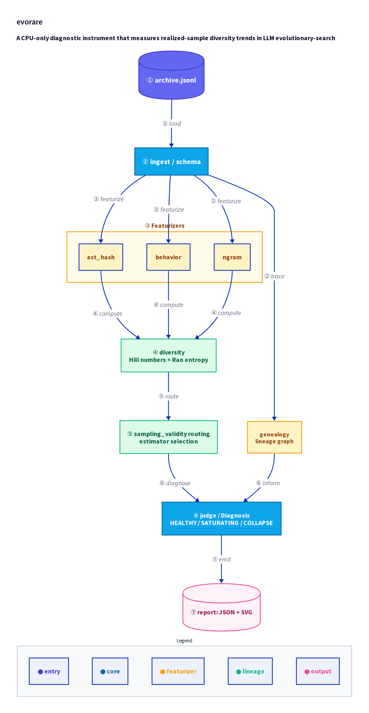

# evorare

[](LICENSE)
[](https://github.com/hinanohart/evorare/actions/workflows/ci.yml)

**A CPU-only diagnostic instrument that measures realized-sample diversity trends in LLM evolutionary-search archives.**

`evorare` reads a JSON-Lines archive produced by FunSearch, AlphaEvolve, ShinkaEvolve, OpenEvolve, or any compatible evolutionary-search framework and computes **Hill numbers** and **Rao quadratic entropy** across generations. It then routes which estimators are statistically valid for the archive and emits a diversity-trend verdict (`HEALTHY`, `SATURATING`, `GENEALOGY-COLLAPSE`, `INDETERMINATE`, or `DESCRIPTIVE`).

> **What it is — and is not.**
> evorare **describes realized-sample diversity only; does not estimate population diversity.**
> The default featurizers measure **syntactic/structural diversity, not semantic diversity**.
> It is a **diagnostic instrument, not a stopping guarantee.**
> All headline numbers come from **synthetic** ground-truth scenarios with known labels.

No model calls. No GPU. Core dependency: **numpy** only.

---

## Architecture

<div align="center">
  
</div>

Data flows top to bottom: raw records are ingested, featurized into species histograms, passed through Hill-number and Rao-Q computation, filtered by the sampling-validity router, then merged with optional genealogy analysis to produce a final verdict and structured report.

---

## Install

```bash
pip install evorare            # core (numpy only); convert adapters are built in
pip install "evorare[embed]"   # + optional semantic-embedding featurizer (experimental)
```

## Quickstart

```bash
# Diagnose a JSON-Lines archive
evorare diagnose archive.jsonl --featurizer behavior,ast --out result.json --svg out.svg

# Run sensitivity gates G1..G9 (exits 0 on all pass, 1 otherwise)
evorare gate

# Convert a framework checkpoint to the evorare JSON-Lines format
evorare convert openevolve <checkpoint_dir> -o archive.jsonl
```

**Archive format** — one JSON record per line:

```json
{"id": "p17", "code": "def f(): ...", "score": 0.83, "generation": 4, "parent_id": "p9", "island_id": 1}
```

Required fields: `id`, `code`, `score`. Optional: `generation`, `parent_id`, `island_id`.

---

## How it works

### Diversity metrics

evorare featurizes each program into a discrete type (species) and computes per-generation histograms. From those histograms it derives:

- **Hill q0** — richness (count of distinct types)
- **Hill q1** — Shannon effective number (exponential of entropy); the primary stopping signal
- **Hill q2** — Simpson effective number
- **Rao quadratic entropy (Q)** — pairwise-distance-weighted diversity; second stopping signal

Slopes and 95 % bootstrap confidence intervals are computed from the per-generation series. A verdict requires at least 3 generations; with fewer generations the result is `DESCRIPTIVE`.

### Sampling-validity routing

Under strong selection, Good-Turing coverage and Chao estimators are not valid. `evorare` detects this automatically (via the `sampling_validity` module) and excludes those estimators from the stopping decision rather than silently propagating invalid statistics.

### Genealogy (optional)

When `parent_id` is present in the archive, evorare builds a lineage graph, computes root-lineage survivorship per generation, and bootstraps the survivorship slope. A significant decline combined with a relative drop above 30 % triggers `GENEALOGY-COLLAPSE`.

### Verdict rules

| Verdict | Condition |
|---|---|
| `HEALTHY` | Hill q1 CI lower bound > 0 and Rao Q not significantly decreasing |
| `SATURATING` | Hill q1 CI upper bound < 0 and Rao Q not significantly increasing |
| `GENEALOGY-COLLAPSE` | Survivorship slope CI < 0 and relative lineage drop > 30 % |
| `INDETERMINATE` | Directional conflict between featurizer resolutions |
| `DESCRIPTIVE` | Fewer than 3 generations, or insertion-order proxy used |

---

## Validation on synthetic ground truth

All numbers below are produced by `evorare gate` / `python scripts/run_bench.py` and stored in
[`results/v0.1.0a2_metrics.json`](results/v0.1.0a2_metrics.json) (seed=0, 20 seeds/scenario,
8 generations, 120-resample bootstrap). They are **synthetic** ground-truth checks, not real
framework results.

| Sensitivity gate (G1–G9, all passing) | Result |
|---|---|
| G2 — separate growing vs depleting diversity (Hill q1 trend, AUC) | **1.00** |
| G3 — locate a planted lineage bottleneck within ±2 generations | **1.00** |
| G3 — false lineage-collapse on a stationary (turnover-only) archive | **0.00** |
| G8 — exclude coverage when selection breaks it (S-AGGREGATED) | **1.00** |
| G8 — false exclusion under uniform sampling (S-NULL) | **0.00** |

The test suite has **93 tests** (`pytest`), all passing on Ubuntu and Windows for Python 3.10–3.12.

> The Hill q1 *slope* point estimate is a plug-in value; its confidence interval is a bootstrap
> percentile interval and may not be centred on the point estimate, because the Hill q1 plug-in
> is downward-biased under finite-sample resampling (a known property of diversity estimators).
> The verdict uses the interval, which is the conservative, statistically meaningful quantity.

---

## Prior art & honest limits

See [docs/limits.md](docs/limits.md). evorare builds on established ecology estimators
(**Chao**, **rarefaction**, Hill numbers, Rao Q) and population-genetics lineage statistics;
the contribution is their transplant to LLM evolutionary-search archives plus the
sampling-validity routing. Prior diversity management inside **FunSearch** / AlphaEvolve uses
island models and behavior descriptors; evorare is a framework-agnostic external diagnostic.

---

## License

MIT — see [LICENSE](LICENSE).

